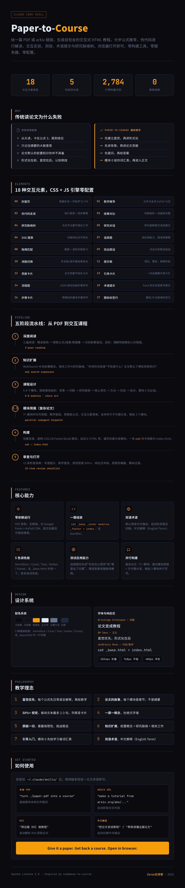

<p align="center">
  <a href="#english">English</a> | <a href="#中文">中文</a>
</p>

---

<a id="english"></a>

# Paper-to-Course

**Turn any academic paper into a beautiful, interactive HTML tutorial.**

Give it a PDF or an arXiv URL. Get back a self-contained `index.html` with step-by-step math derivations, pseudocode walkthroughs, interactive experiments, quizzes, glossary tooltips, and research lineage trees. Open in any browser. No build tools, no server, no config.

<p align="center">
  
</p>

---

## Why This Exists

Reading papers the traditional way goes like this: start from the top, get stuck on equation 3, skip to the conclusion, walk away with a vague memory of the abstract.

Paper-to-Course flips the order. **Intuition before formalism. Background before the paper's contribution. Questions before answers.** The learner builds a mental model of *why* the paper matters before confronting the math that formalizes it.

The target audience is "curious practitioners" — engineers, researchers, analysts who encounter papers in their work and need deep understanding, not surface skims.

---

## What You Get

A directory with a single `index.html` and supporting files:

```
your-paper-course/
  styles.css       # Design system (warm off-white, Catppuccin code blocks)
  main.js          # All interactive engines (IIFE, no dependencies)
  _base.html       # HTML shell (customized per course)
  _cover.html      # Hero section with paper metadata
  _footer.html     # Closing tags
  build.sh         # One-line assembly: cat parts → index.html
  modules/
    00-background.html   # Module 0: Prerequisites (always present)
    01-problem.html      # The problem the paper solves
    02-landscape.html    # Research landscape
    03-insight.html      # The key insight
    04-method.html       # Method details
    05-experiments.html  # Experiments & results
    06-implications.html # Implications & going further
  index.html       # Assembled output — open this
```

The only external dependencies are Google Fonts (Bricolage Grotesque, DM Sans, JetBrains Mono) and KaTeX CDN for math rendering. After the first load, the page works offline.

---

## 18 Interactive Element Types

Every course is built from these components. The CSS and JS live in `styles.css` and `main.js` — copied verbatim, no modifications needed.

| # | Element | What It Does |
|---|---------|-------------|
| 0 | Cover Page | Hero section with paper title, authors, abstract, "Start Learning" CTA |
| 1 | Math Derivation | Click-through step-by-step equations with KaTeX re-rendering |
| 2 | Pseudocode Walkthrough | Line-by-line highlighting with synced explanation panels |
| 3 | Result Comparison | Toggle metrics, animated bars, side-by-side numbers |
| 4 | Research Lineage Tree | Click nodes to expand related work details |
| 5 | Research Dialogue | Sequential message reveal (like a group chat between researchers) |
| 6 | SVG Diagrams | Inline, responsive, design-system-consistent visuals |
| 7 | Multiple-Choice Quizzes | Test application, not memorization. Wrong answers get explanations |
| 8 | Drag-and-Drop | Touch + mouse matching exercises with ghost elements |
| 9 | Spot the Assumption | Click-to-identify or quiz-style assumption challenges |
| 10 | Ablation Toggle | Toggle layers/components to see what changes |
| 11 | Callout Boxes | Key insights, warnings, "aha!" moments |
| 12 | Contribution Cards | Visual cards for paper contributions or concepts |
| 13 | Paper Citation Cards | Styled citation cards with one-sentence summaries |
| 14 | Flow Diagrams | JSON-driven animated step sequences with packet movement |
| 15 | Glossary Tooltips | `position: fixed` tooltips on every technical term |
| 16 | Step Cards | Numbered sequential steps with icons |
| 17 | Icon-Label Rows | Compact labeled icon rows for properties/methods |

---

## The 5-Phase Pipeline

### Phase 1: Deep Reading

The paper is read in three passes: skim for structure, extract equations/results/datasets, identify the narrative arc. The goal is to understand the paper well enough to teach it.

### Phase 2: Knowledge Expansion

WebSearch fills in prerequisite concepts, related work, and research context. What would a "curious practitioner" not know? What background does the paper assume?

### Phase 3: Curriculum Design

5–8 modules structured as a story: background → problem → landscape → key insight → method → experiments → results → implications. Module 0 (Background & Prerequisites) is mandatory. No approval step — the skill builds it directly.

### Phase 3.5: Module Briefs (complex papers)

For papers with 7+ modules, briefs are written first: teaching arc, pre-extracted equations, interactive element checklist, reference file sections. Enables parallel subagent dispatch.

### Phase 4: Build

Creates the output directory, copies `styles.css`, `main.js`, `_footer.html`, `build.sh` verbatim from references, customizes `_base.html` (title, accent color palette, nav dots, sidebar items), writes `_cover.html`, writes each module as a separate HTML file, then runs `build.sh` to assemble.

### Phase 5: Review & Open

Opens `index.html` and walks through a 15-item review checklist covering tooltips, math intuition, visual density, responsive layout, and more.

---

## Design System

Every course inherits the same visual language:

- **Colors**: Warm off-white backgrounds (`#FAF7F2`), 5 accent palettes (Vermillion `#D94F30` default, Coral, Teal, Amber, Forest), Catppuccin-inspired dark code blocks (`#1E1E2E`)
- **Typography**: Bricolage Grotesque (headings), DM Sans (body), JetBrains Mono (code/math)
- **Layout**: Sidebar navigation with scroll-sync, scroll-snap `y proximity`, progress bar
- **Responsive**: 1024px (sidebar collapses), 768px, 480px breakpoints
- **Animations**: fade-slide-up reveals, typing bounce, scroll-triggered stagger

Customize per course by picking an accent palette in `_base.html`. Everything else is automatic.

---

## Teaching Philosophy

- **Intuition first, then formalism** — every equation gets a plain-language explanation before the math
- **The paper's story** — each module is a chapter, not a section summary
- **50%+ visual** — max 2–3 sentences per text block, convert lists to cards, pipelines to flow diagrams
- **One concept per screen** — no walls of text
- **Question everything** — surface limitations, challenge assumptions, test application not recall
- **Knowledge expansion** — prerequisite concepts, research lineage, related work
- **Guided entry** — Module 0 gives learners the vocabulary before the paper's contribution
- **Bilingual glossary** — format: `Chinese explanation (English Term)`

---

## How to Use

This is a [Claude Code](https://docs.anthropic.com/en/docs/claude-code) skill. After installing it in `~/.claude/skills/`, use any trigger phrase:

**English:**
- "turn this paper into a course"
- "explain this paper interactively"
- "make a tutorial from this paper"
- "teach me this paper"
- "interactive walkthrough of this research"
- "convert this PDF to a tutorial"

**Chinese:**
- "把论文变成教程"
- "帮我读懂这篇论文"
- "论文转课程"
- "做一份论文教程"

Provide a paper source:
- Local PDF: `"turn ./paper.pdf into a course"`
- arXiv URL: `"make a tutorial from https://arxiv.org/abs/xxxx.xxxxx"`
- DOI: resolve automatically via web fetch

The skill handles everything. Open the generated `index.html` in your browser when it's done.

---

## Language

Default output: **Simplified Chinese**. Auto-detects user input language and switches. Glossary tooltips are bilingual: `中文解释（English Term）`.

---

## Project Structure

```
paper-to-course/
  SKILL.md                              # Main skill definition (5-phase pipeline)
  README.md                             # This file
  references/
    styles.css                          # ~2,000 lines CSS design system
    main.js                             # ~777 lines interactive JS engines
    _base.html                          # HTML shell template
    _footer.html                        # Closing tags
    build.sh                            # Assembly script (cat → index.html)
    design-system.md                    # Design tokens documentation
    interactive-elements.md             # HTML patterns for 17 element types
    content-philosophy.md               # Teaching principles & quiz philosophy
    gotchas.md                          # 20 common failure points
    module-brief-template.md            # Template for parallel module writing
```

---

## Credits

Inspired by [codebase-to-course](https://github.com/zarazhangrui/codebase-to-course) by Zara (@zarazhangrui).

---

## License

[Apache License 2.0](LICENSE)

---

<p align="center">
  <a href="#english">English</a> | <a href="#中文">中文</a>
</p>

---

<a id="中文"></a>

# Paper-to-Course

**将任何学术论文转换为精美的交互式 HTML 教程。**

给它一篇 PDF 或 arXiv 链接，它会生成一个自包含的 `index.html`，包含分步公式推导、伪代码逐行解读、交互式实验对比、测验、术语提示和研究脉络树。用浏览器打开即可，无需构建工具、服务器或任何配置。

<p align="center">
  
</p>

---

## 为什么做这个

传统读论文的流程：从头读，卡在公式 3，跳到结论，最后只记住摘要的大致意思。

Paper-to-Course 反过来。**先建立直觉，再讲形式化。先讲背景，再讲论文贡献。先提问，再给答案。** 学习者在面对数学之前，先建立"这篇论文为什么重要"的心智模型。

目标受众是"好奇的实践者"——工程师、研究员、分析师，工作中遇到论文需要深入理解，而非浅尝辄止。

---

## 你会得到什么

一个目录，包含 `index.html` 和支撑文件：

```
your-paper-course/
  styles.css       # 设计系统（暖白色背景，Catppuccin 代码块）
  main.js          # 所有交互引擎（IIFE，无外部依赖）
  _base.html       # HTML 壳（每门课自定义）
  _cover.html      # 首页英雄区块，含论文元数据
  _footer.html     # 闭合标签
  build.sh         # 一行组装：cat 各部分 → index.html
  modules/
    00-background.html   # 模块 0：前置知识（始终存在）
    01-problem.html      # 论文要解决的问题
    02-landscape.html    # 研究脉络
    03-insight.html      # 核心洞见
    04-method.html       # 方法细节
    05-experiments.html  # 实验与结果
    06-implications.html # 启示与延伸
  index.html       # 组装产物——打开这个
```

仅有的外部依赖是 Google Fonts（Bricolage Grotesque、DM Sans、JetBrains Mono）和 KaTeX CDN 数学渲染。首次加载后可离线使用。

---

## 18 种交互元素

每门课程由这些组件构建。CSS 和 JS 存放在 `styles.css` 和 `main.js` 中——原样复制，无需修改。

| # | 元素 | 作用 |
|---|------|------|
| 0 | 封面页 | 英雄区块，含论文标题、作者、摘要、"开始学习"按钮 |
| 1 | 数学推导 | 分步点击式公式推导，支持 KaTeX 重新渲染 |
| 2 | 伪代码走读 | 逐行高亮 + 同步解释面板 |
| 3 | 结果对比 | 切换指标、动画条形图、并排数据 |
| 4 | 研究脉络树 | 点击节点展开相关工作详情 |
| 5 | 研究对话 | 顺序消息展示（像研究者之间的群聊） |
| 6 | SVG 图表 | 内联、响应式、设计系统一致的可视化 |
| 7 | 选择题 | 测试应用能力而非记忆，错误答案有解释 |
| 8 | 拖拽匹配 | 触屏 + 鼠标，带幽灵元素的匹配练习 |
| 9 | 找出假设 | 点击识别或问答式假设挑战 |
| 10 | 消融切换 | 切换层/组件，看效果变化 |
| 11 | 提示框 | 关键洞见、警告、"顿悟！"时刻 |
| 12 | 贡献卡片 | 论文贡献或概念的可视化卡片 |
| 13 | 论文引用卡片 | 带一句话摘要的精美引用卡片 |
| 14 | 流程图 | JSON 驱动的动画步骤序列，含数据包移动效果 |
| 15 | 术语提示 | 每个专业术语的 `position: fixed` 悬浮提示 |
| 16 | 步骤卡片 | 带图标的编号步骤序列 |
| 17 | 图标标签行 | 属性/方法的紧凑图标标签行 |

---

## 五阶段流水线

### 阶段 1：深度阅读

三遍阅读论文：略读获取结构，提取公式/结果/数据集，识别叙事弧线。目标是理解到能教别人的程度。

### 阶段 2：知识扩展

通过 WebSearch 补充前置概念、相关工作与研究脉络。"好奇的实践者"不知道什么？论文默认了哪些背景知识？

### 阶段 3：课程设计

5–8 个模块，按故事线组织：背景 → 问题 → 研究脉络 → 核心洞见 → 方法 → 实验 → 结果 → 启示。模块 0（背景与前置知识）为必选模块。无需审批，技能直接构建。

### 阶段 3.5：模块简报（复杂论文）

7 个模块以上的论文，先写简报：教学弧线、预提取公式、交互元素清单、参考文件章节。支持并行子代理分发。

### 阶段 4：构建

创建输出目录，从 references 原样复制 `styles.css`、`main.js`、`_footer.html`、`build.sh`，自定义 `_base.html`（标题、强调色板、导航点、侧边栏），编写 `_cover.html`，各模块独立 HTML 文件，运行 `build.sh` 组装。

### 阶段 5：审查与打开

打开 `index.html`，逐项检查 15 条审查清单：术语提示、数学直觉、视觉密度、响应式布局等。

---

## 设计系统

每门课程继承相同的视觉语言：

- **配色**：暖白色背景（`#FAF7F2`），5 种强调色板（Vermillion 朱红 `#D94F30` 默认、Coral 珊瑚、Teal 青色、Amber 琥珀、Forest 森林），Catppuccin 风格深色代码块（`#1E1E2E`）
- **字体**：Bricolage Grotesque（标题）、DM Sans（正文）、JetBrains Mono（代码/数学）
- **布局**：侧边栏导航 + 滚动同步、scroll-snap `y proximity`、进度条
- **响应式**：1024px（侧边栏折叠）、768px、480px 断点
- **动画**：淡入上滑、打字弹跳、滚动触发渐显

每门课只需在 `_base.html` 中选择强调色板，其余自动完成。

---

## 教学理念

- **直觉优先，形式化在后**——每个公式先用日常语言解释，再给出数学
- **论文的故事**——每个模块是故事的一个章节，不是论文的一节摘要
- **50% 以上视觉内容**——每块文本最多 2–3 句，列表变卡片，流水线变流程图
- **一屏一概念**——杜绝文字墙
- **质疑一切**——暴露局限性、挑战假设、测试应用而非回忆
- **知识扩展**——前置概念、研究脉络、相关工作
- **引导入门**——模块 0 在论文贡献之前先给学习者词汇表
- **双语术语**——格式：`中文解释（English Term）`

---

## 使用方法

这是一个 [Claude Code](https://docs.anthropic.com/en/docs/claude-code) 技能。安装到 `~/.claude/skills/` 后，使用任何触发短语：

**英文：**
- "turn this paper into a course"
- "explain this paper interactively"
- "make a tutorial from this paper"
- "teach me this paper"
- "interactive walkthrough of this research"
- "convert this PDF to a tutorial"

**中文：**
- "把论文变成教程"
- "帮我读懂这篇论文"
- "论文转课程"
- "做一份论文教程"

提供论文来源：
- 本地 PDF：`"把 ./paper.pdf 转成教程"`
- arXiv 链接：`"用 https://arxiv.org/abs/xxxx.xxxxx 做教程"`
- DOI：自动通过网页获取解析

技能自动处理一切。完成后用浏览器打开生成的 `index.html` 即可。

---

## 语言

默认输出：**简体中文**。自动检测用户输入语言并切换。术语提示为双语格式：`中文解释（English Term）`。

---

## 项目结构

```
paper-to-course/
  SKILL.md                              # 主技能定义（五阶段流水线）
  README.md                             # 本文件
  references/
    styles.css                          # ~2,000 行 CSS 设计系统
    main.js                             # ~777 行交互 JS 引擎
    _base.html                          # HTML 壳模板
    _footer.html                        # 闭合标签
    build.sh                            # 组装脚本（cat → index.html）
    design-system.md                    # 设计令牌文档
    interactive-elements.md             # 17 种元素的 HTML 模式
    content-philosophy.md               # 教学理念与测验哲学
    gotchas.md                          # 20 个常见失败点
    module-brief-template.md            # 并行模块写作模板
```

---

## 致谢

灵感来自 [codebase-to-course](https://github.com/zarazhangrui/codebase-to-course)，作者 Zara (@zarazhangrui)。

---

## 许可证

[Apache License 2.0](LICENSE)
